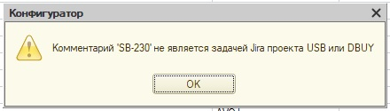

## oproxy - TCP прокси-сервер хранилища конфигураций 1С

Написан на нативном OneScript. Вдохновлен [winow](https://github.com/autumn-library/winow)

Для работы прокси-сервера необходимо установить и настроить [tcp сервер хранилищ 1С](https://wiseadvice-it.ru/o-kompanii/blog/articles/hranilishhe-konfiguracii-v-1s-8-3-ustanovka-i-nastroika/)

- Не работает с файловым вариантом хранилища
- Не работает с хранилищем по HTTP, только TCP
- Но нативная HTTP публикация может смотреть на порт прокси (то есть вы будете пользоваться HTTP хранилищем, но внутри него поток данных будет проходить через прокси)

Прокси-сервер позволяет перехватывать и обрабатывать некоторые события хранилища конфигурации (помещение версии в хранилище и изменение версии) и при необходимости возвращать нативную ошибку в конфигуратор.

Например, при помещении версии в хранилище можно проверить комментарий на соответствие регулярному выражению в зависимости от имени системы, либо произвести вызов к Jira и проверить что задача с таким номером существует. Запретить помещать версии в определенные часы, вызвать старт пайплайна в GitLab или Jenkins, запустить GitSync, обратиться к API кофемашины, отправить случайный мем в Телеграме - все на что у вас хватит фантазии и скиллов в программировании на OneScript.

### Принцип работы
Прокси сервер:
- слушает указанный tcp-порт
- получает пакеты данных от конфигуратора
- анализирует их
- отправляет пакеты tcp-серверу хранилища
- может не отправлять данные серверу хранилища, а вернуть в конфигуратор ошибку (по условию написанному вами в коде)

Чтобы не нарушить целостность хранилища 1С, прокси не изменяет данные, которые идут из конфигуратора в хранилище и обратно. Данные передаются в неизменном виде. Прокси может только прервать передачу данных в сторону хранилища и вернуть ошибку в конфигуратор.

Есть 2 варианта установки ошибки:
- при создании версии хранилища (Поместить в хранилище...)
- при изменении версии хранилища (в истории хранилища)

Прокси сервер запускается из отдельной папки, в которой функция инициализации создаст файл "ПроверкиПроксиСервера.os" для написания проверок/вызовов/веб-хуков. В этом файле изначально есть 2 функции для обработки 2 вариантов установки ошибки. Этот скрипт редактируется пользователем прокси-сервера и используется прокси-сервером. Скрипт "ПроверкиПроксиСервера.os" не является частью дистрибутива прокси-сервера, полностью отдан во владение пользователю. Главное чтобы в нем были все необходимые (целых две) для прокси-сервера функции :)

### Установка
```
opm install oproxy
```

### Инициализация
После установки следует создать каталог, в котором будет располагаться файл с проверками/веб-хуками/вызовами пайплайнов/анекдотами. Например D:\oproxy_catalog. Перейти в этот каталог и вызвать функцию инициализации:
```
cd D:\oproxy_catalog
oproxy init
```
В каталоге создастся файл ПроверкиПроксиСервера.os.

В нем 2 функции:
```bsl
Функция ОбработкаПомещенияВХранилище(ПараметрыЗапроса)
Функция ОбработкаИзмененияВерсииХранилища(ПараметрыЗапроса)
```
ПараметрыЗапроса - это структура, в которой всегда есть поля:
- ИмяСистемы - Строка - название хранилища в нижнем регистре. Название такое же, как при подключении конфигуратора к хранилищу. Например для подключения tcp://server.local:1544/baza ИмяСистемы будет baza
- ИмяМетода - Строка - DevDepot_commitObjects (для помещения в хранилище) или DevDepot_changeVersion (для изменения версии хранилища)
- ВерсияПлатформы - Строка - версия платформы, с которой обращается конфигуратор, например 8.3.22.2143
- Комментарий - Строка - текст, который пользователь указал при помещении или изменении версии хранилища в поле "Комментарий"
- Проверять - Булево - всегда Истина
- ИмяПользователя - Строка - имя пользователя хранилища, под которым произошло обращение

В этом файле можно написать свои проверки и вызовы. Например файл может быть такой:
```bsl
Функция ОбработкаПомещенияВХранилище(ПараметрыЗапроса)
    СообщениеОбОшибке = "";
    Если ПараметрыЗапроса.ИмяБазы = "baza1" Тогда
        Если НЕ СтрНачинаетсяС(ПараметрыЗапроса.Комментарий, "ERP-") Тогда
            СообщениеОбОшибке = "Комментарий должен начинаться с ""ERP-""!";
        Иначе
            //...
        КонецЕсли;
    КонецЕсли;
    Если НЕ ПустаяСтрока(СообщениеОбОшибке) Тогда
        ОтправитьДоносНачальникуВТелеграм(ПараметрыЗапроса.ИмяПользователя, ПараметрыЗапроса.Комментарий);
    Иначе
        ОтправитьКомандуЗаваркиКофе_В_АПИ_КофеМашины();
    КонецЕсли;
    Возврат СообщениеОбОшибке;
КонецФункции
Функция ОбработкаИзмененияВерсииХранилища(ПараметрыЗапроса)
    СообщениеОбОшибке = "";
    Если ДеньНедели() = 5 Тогда
        СообщениеОбОшибке = "По пятницам комментарии не меняем";
    Иначе
        ОткатитьГитДоВерсииИПерезапуститьГитСинк();
    КонецЕсли;
    Возврат СообщениеОбОшибке;
КонецФункции
```
А там уж на что у вас фантазии хватит.
### Запуск сервера
Запускать прокси-сервер необходимо из того каталога, где лежит файл ПроверкиПроксиСервера.os, т.к. прокси будет искать файл именно в каталоге запуска.
```
oproxy start --proxy-port 2555 --storage-server localhost --storage-port 2544
```
Где:
- --proxy-port - Число - номер порта, по которому прокси будет слушать соединения (и который надо будет указывать в конфигураторе)
- --storage-server - Строка - имя сервера, на котором развернут tcp сервер хранилища 1С. Пишется без "tcp://", без номера порта, просто имя сервера. Если прокси запускается на той же машине, где развернут сервер хранилища, можно указать localhost или 127.0.0.1
- --storage-port - Число - порт развернутого tcp хранилища 1С

Для приведенного выше примера, если у нас сервер называется server.local, а имя базы в хранилище baza1, в конфигураторе надо будет писать адрес tcp://server.local:2555/baza1

Не забудьте в фаерволе операционной системы и/или роутеров открыть порт, указанный в --proxy-port, иначе никто из сети не сможет обращаться к прокси-серверу.

### Пример отображения ошибки в конфигураторе



### Как запустить в фоне
Рекомендую запускать с помощью [NSSM](https://nssm.cc/) для Windows. Рабочий каталог - тот, в котором лежит файл ПроверкиПроксиСервера.os. Команда запуска - в предыдущем пункте.

### Кроссплатформенность и производительность
Протестировано на Windows Server с 1С 8.3.22.2143 и OneScript 1.8.4.5. Потребление ОЗУ ~50-100 МБ, иногда может вырастать чуть больше на тяжелых операциях, но вскоре сборщик мусора эту память освободит. ERP и бухгалтерия работают с той же скоростью, как и напрямую по tcp. Проведено создание хранилища, подключение, отключение, сравнение версий в разных вариациях, выгрузка файла CF из версии хранилища, захват и помещение объектов конфигурации, в том числе и глобальные, и прочее-прочее-прочее...

Про Linux и MacOS не знаю - буду рад отзывам!

### Приятного использования!
Если вы нашли ошибку работы в прокси или хотите в него добавить какой-то функционал - пожалуйста, напишите в issues. Если у вас есть желание доработать/отрефакторить прокси - ждем ваших pull requests <3
