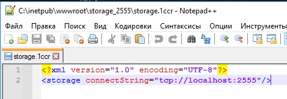

[](https://github.com/infina15/oproxy/actions/workflows/test.yml)
## oproxy - TCP прокси-сервер хранилища конфигураций 1С

Написан на [OneScript](https://github.com/EvilBeaver/OneScript). Вдохновлен [winow](https://github.com/autumn-library/winow)

Для работы прокси-сервера необходимо установить и настроить [TCP сервер хранилищ 1С](https://wiseadvice-it.ru/o-kompanii/blog/articles/hranilishhe-konfiguracii-v-1s-8-3-ustanovka-i-nastroika/)

Прокси-сервер:
- Не работает с файловым вариантом хранилища
- Не работает с хранилищем по HTTP, только TCP
- Но нативная HTTP публикация может смотреть на порт прокси ([далее](#http_link))

Прокси-сервер позволяет перехватывать и обрабатывать некоторые события хранилища конфигурации (помещение версии в хранилище и изменение версии) и при необходимости возвращать нативную ошибку в конфигуратор.

Например, при помещении версии в хранилище можно проверить комментарий на соответствие регулярному выражению в зависимости от имени системы, либо произвести вызов к Jira и проверить что задача с таким номером существует. Запретить помещать версии в определенные часы, вызвать старт пайплайна в GitLab или Jenkins, запустить GitSync, обратиться к API кофемашины, отправить случайный мем в Телеграме - все на что у вас хватит фантазии и скиллов в программировании на OneScript.

### Принцип работы
Прокси сервер:
- слушает указанный tcp-порт
- получает пакеты данных от конфигуратора
- анализирует их
- отправляет пакеты tcp-серверу хранилища
- может не отправлять данные серверу хранилища, а вернуть в конфигуратор ошибку (по условию написанному вами в коде)

Чтобы не нарушить целостность хранилища 1С, прокси не изменяет данные, которые идут из конфигуратора в хранилище и обратно. Данные передаются в неизменном виде. Прокси может только прервать передачу данных в сторону хранилища и вернуть ошибку в конфигуратор.

Есть 2 варианта установки ошибки:
- при создании версии хранилища (Поместить в хранилище...)
- при изменении версии хранилища (в истории хранилища)

Прокси сервер запускается из отдельной папки, в которой функция инициализации создаст файл "ПроверкиПроксиСервера.os" для написания проверок/вызовов/веб-хуков. Так же допускается указание полного пути к файлу проверок. В этом файле изначально есть 2 функции для обработки 2 вариантов установки ошибки. Этот скрипт редактируется пользователем прокси-сервера и используется прокси-сервером. Скрипт "ПроверкиПроксиСервера.os" не является частью дистрибутива прокси-сервера, полностью отдан во владение пользователю, его можно редактировать во время работы прокси. Главное чтобы в нем были все необходимые (целых две) для прокси-сервера функции :)

### Установка
В командной строке:
```
opm install oproxy
```
Либо [скачать файл .ospx из последнего релиза](https://github.com/infina15/oproxy/releases/latest), либо из хаба [hub.oscript.io](https://hub.oscript.io/package/oproxy) и (подставить нужное имя файла):
```
opm install --file oproxy-0.0.4.ospx
```

### Инициализация
После установки следует создать каталог, в котором будет располагаться файл с проверками/веб-хуками/вызовами пайплайнов/анекдотами. Например D:\oproxy_catalog. Перейти в этот каталог и вызвать функцию инициализации:
```
cd D:\oproxy_catalog
oproxy init
```
В каталоге создастся файл ПроверкиПроксиСервера.os. Этот файл можно скопировать в любое другое место и потом при запуске указать к нему полный путь.

Также файл можно найти в дистрибутиве библиотеки в каталоге features под названием ПроверкиПроксиСервера_Пример.os и скопировать руками куда хочется.

В нем 3 функции:
```bsl
Функция ОбработкаПомещенияВХранилище(ПараметрыЗапроса) Экспорт
Функция ОбработкаИзмененияВерсииХранилища(ПараметрыЗапроса) Экспорт
Функция ПостОбработкаПомещенияВХранилище() Экспорт
```
ПараметрыЗапроса - это структура, в которой всегда есть поля:
- ИмяСистемы - Строка - название хранилища в нижнем регистре. Название такое же, как при подключении конфигуратора к хранилищу. Например для подключения tcp://server.local:1544/BAZA ИмяСистемы будет baza
- ИмяМетода - Строка - DevDepot_commitObjects (для помещения в хранилище) или DevDepot_changeVersion (для изменения версии хранилища)
- ВерсияПлатформы - Строка - версия платформы, с которой обращается конфигуратор, например 8.3.22.2143
- Проверять - Булево - всегда Истина
- ИмяПользователя - Строка - имя пользователя хранилища, под которым произошло обращение. В том регистре, в котором указано в настройках хранилища.
- ВерсияКонфигурации - Строка - значение поля "Версия конфигурации" в истории хранилища
- Комментарий - Строка - текст, который пользователь указал при помещении или изменении версии хранилища в поле "Комментарий" (может быть пустым, даже если комментарий не был изменен)
- КомментарийБыл - Строка - текст, который был указан при изменении версии хранилища в поле "Комментарий" (заполнен только для изменения версии хранилища)
- Метка - Строка - метка, указываемая при изменении версии хранилища
- КомментарийМетки - Строка - комментарий метки при изменении версии хранилища

В этом файле можно написать свои проверки и вызовы. Например файл может быть такой:
```bsl
Функция ОбработкаПомещенияВХранилище(ПараметрыЗапроса) Экспорт
    СообщениеОбОшибке = "";
    Если ПараметрыЗапроса.ИмяСистемы = "baza1" Тогда
        Если НЕ СтрНачинаетсяС(ПараметрыЗапроса.Комментарий, "ERP-") Тогда
            СообщениеОбОшибке = "Комментарий должен начинаться с ""ERP-""!";
        Иначе
            //...
        КонецЕсли;
    КонецЕсли;
    Если НЕ ПустаяСтрока(СообщениеОбОшибке) Тогда
        ОтправитьДоносНачальникуВТелеграм(ПараметрыЗапроса.ИмяПользователя, ПараметрыЗапроса.Комментарий);
    Иначе
        ОтправитьКомандуЗаваркиКофе_В_АПИ_КофеМашины();
    КонецЕсли;
    Возврат СообщениеОбОшибке;
КонецФункции
Функция ОбработкаИзмененияВерсииХранилища(ПараметрыЗапроса) Экспорт
    СообщениеОбОшибке = "";
    Если ДеньНедели() = 5 Тогда
        СообщениеОбОшибке = "По пятницам комментарии не меняем";
    Иначе
        ОткатитьГитДоВерсииИПерезапуститьГитСинк();
    КонецЕсли;
    Возврат СообщениеОбОшибке;
КонецФункции
Функция ПостОбработкаПомещенияВХранилище() Экспорт
    Если ЗдесьМыТочноУжеЗнаемЧтоВсеПоместилосьВХранилище Тогда
        ВызватьЗапускПайплайна();
        СбегатьЗаПивом();
    КонецЕсли;
КонецФункции
```
А там уж на что у вас фантазии хватит.
### Запуск сервера в режиме службы (только для Windows)
В дистрибутиве есть менеджер служб [NSSM](https://nssm.cc/) под 64-битную Windows. Располагается в features\nssm64_oproxy.exe. На него настроены команды создания/удаления/прочие действия со службой прокси-сервера.

### Параметр --daemon-name

Все команды по работе с демоном имеют параметр необязательный параметр --daemon-name (по умолчанию OproxyDaemon). С помощью него можно указать свое имя демона, отличное от значения по умолчанию. Данный параметр используется, когда нужно запустить несколько служб одновременно (например на разные версии хранилища).

Команда
```
oproxy create-daemon
```
Создает и запускает службу Windows под названием OproxyDeamon, если такой службы нет.

Если писать так как ниже, то при запуске сервера службой будет попытка поиска файла ПроверкиПроксиСервера.os в текущем каталоге:

```
oproxy create-daemon --proxy-port 2555 --storage-server localhost --storage-port 2544
```
Или вот так, с указанием полного имени к файлу проверок (текущий каталог не важен):
```
oproxy create-daemon --proxy-port 2555 --storage-server server.local --storage-port 2544 --check-file D:\oproxy_folder\Проверки.os
```
В данных примерах:
- --proxy-port - Число - номер порта, по которому прокси будет слушать соединения (и который надо будет указывать в конфигураторе)
- --storage-server - Строка - имя сервера, на котором развернут tcp сервер хранилища 1С. Пишется без "tcp://", без номера порта, просто имя сервера. Если прокси запускается на той же машине, где развернут сервер хранилища, можно указать localhost или 127.0.0.1
- --storage-port - Число - порт развернутого tcp хранилища 1С
- --check-file - Строка - (необязательный) полный путь на диске к файлу с проверками

Для приведенного выше примера, если у нас сервер называется server.local, а имя базы в хранилище baza1, в конфигураторе надо будет писать адрес tcp://server.local:2555/baza1

Также есть команды:
```
oproxy start-daemon &:: запускает остановленную службу
```
```
oproxy check-file   &:: проверяет файл ПроверкиПроксиСервера.os в текущией папке (либо указанный файл в параметре) на предмет того, что он может быть использован прокси-сервером
```
```
oproxy stop-daemon  &::останавливает запущенную службу
```
```
oproxy restart-daemon   &::перезапускает существующую службу
```
```
oproxy remove-daemon    &:: останавливает и удаляет существующую службу
```

Не забудьте в фаерволе операционной системы и/или роутеров открыть порт, указанный в --proxy-port, иначе никто из сети не сможет обращаться к прокси-серверу.

По умолчанию NSSM использует системного пользователя. Если вам это не подходит и вы хотите осуществить более тонкую настройку службы - можно настраивать NSSM вручную (информация на сайте [NSSM](https://nssm.cc/)) c [помощью ручных команд запуска](#manual_link).

Важно: чтобы NSSM запустил oproxy, надо писать в строке запуска не:
```
oproxy start <параметры>
```
А:
```
oproxy.bat start <параметры>
```
Потому что NSSM умеет смотреть в переменную PATH, но не находит файлы по имени без расширения.
<a name="manual_link"></a>
### Запуск сервера вручную
Запускать прокси-сервер необходимо из того каталога, где лежит файл ПроверкиПроксиСервера.os, т.к. прокси будет искать файл именно в каталоге запуска.
```
oproxy start --proxy-port 2555 --storage-server localhost --storage-port 2544
```
Либо можно использовать необязательный параметр указания файла той же команды:
```
oproxy start --proxy-port 2555 --storage-server localhost --storage-port 2544 --check-file D:\oproxy_folder\Проверки.os
```

### Файл проверок можно редактировать во время работы сервера
При новом очередном TCP-соединении конфигуратора и хранилища (конфигуратор постоянно подключается и отключается) прокси-сервер увидит, что момент изменения файла проверок стал новым, и переподключит сценарий заново. Новое соединение произойдет, например, при обновлении истории хранилища. Заново загруженный сценарий начнет работать сразу для всех соединений.

Если в файле проверок будет допущена ошибка, прокси-сервер не будет останавливаться, а при проверочных событиях (помещение и изменение версии) в конфигуратор будет возвращаться ванскриптовая ошибка.

Файл можно отредактировать "на лету" и исправить ошибку. В новом соединении файл снова перезагрузится. Но лучше все же писать тесты!

### Пример отображения ошибки в конфигураторе


### <a name="http_link"></a>Подключение по HTTP
Если вы хотите подключаться к прокси по HTTP, необходимо для начала настроить обычное подключение к хранилищу по HTTP. Далее в файле *.1ccr публикации нужно указать порт прокси-сервера:



HTTPS - тоже не забота прокси, настраивается в веб-сервере.

### Кроссплатформенность и производительность
Протестировано на Windows Server с 1С 8.3.22.2143 и OneScript 1.9.0. Потребление ОЗУ ~50-100 МБ, иногда может вырастать чуть больше на тяжелых операциях, но вскоре сборщик мусора эту память освободит. ERP и бухгалтерия работают с той же скоростью, как и напрямую по tcp. Проверено создание хранилища, подключение, отключение, сравнение версий в разных вариациях, выгрузка файла CF из версии хранилища, захват и помещение объектов конфигурации, в том числе и глобальные, и прочее-прочее-прочее...

Про Linux и MacOS не знаю - буду рад отзывам!

### Приятного использования!
Если вы нашли ошибку работы в прокси или хотите в него добавить какой-то функционал, что-то обсудить или спросить - пожалуйста, напишите в [issues](https://github.com/infina15/oproxy/issues). Если у вас есть желание доработать/отрефакторить/улучшить прокси или адаптировать лучше под Linux и MacOS - ждем ваших [pull requests](https://github.com/infina15/oproxy/pulls) <3
